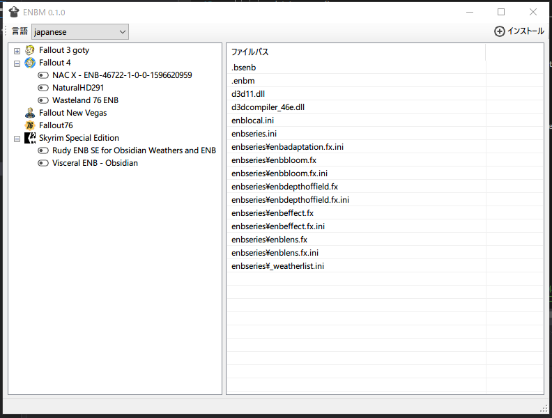

# ENBM

## Overview

ENBプリセットのインストール、アンインストールを補助するツールです

## Requirement

- Staemゲームのみ対応です

## WIP
- エラー対応、イレギュラー操作に関する処理
  例) プリセットフォルダをコピーして差分作ろうとするとGUIDが競合する

## Notice
- アイコンは [ICOOON MONO](https://icooon-mono.com
) 様のものを使用しています
再配布は禁止事項に当たるためリポジトリで管理していません
ビルドする場合は上記サイトから取得するか代替のアイコンをご用意ください

## Licence

[MIT](https://github.com/hananoki/Potemayo/blob/master/LICENSE.md)